# ProLEAP Academy - Live Projects 2026

Production-style learning projects for Cloud, DevOps, Platform Engineering, Automation, Observability and DevSecOps.

> **Repository status:** Modernized 2026 edition. The original project documents are preserved under [`legacy/`](legacy/) for traceability. The Markdown documents in this repository are the current source of truth.

## Purpose

This repository converts classroom knowledge into project-delivery evidence. Each project is designed to make learners practice the full engineering lifecycle:

**Discovery -> requirements -> solution intent -> architecture -> implementation -> source control -> CI/CD -> testing -> observability -> security -> operations -> demo -> retrospective**

The target is not "finish a tutorial." The target is a solution that can be explained, rebuilt, tested, operated and demonstrated.

## Projects

| # | Project | Primary skills | Level | Main specification |
|---|---|---|---|---|
| 1 | **360-Degree Monitoring Platform** | Linux, Prometheus, Grafana, Loki, OpenTelemetry, alerting, runbooks | Intermediate | [Open project](projects/01-360-degree-monitoring/README.md) |
| 2 | **GitHub Contributor Intelligence Service** | REST APIs, GitHub API, AWS, Python, database, async processing, security | Intermediate/Advanced | [Open project](projects/02-github-contributor-intelligence/README.md) |
| 3 | **Dynamic ETL Automation Platform** | Linux, Python, Excel processing, SQL, secure ingestion, CI/CD, operations | Intermediate/Advanced | [Open project](projects/03-dynamic-etl/README.md) |
| 4 | **Custom Live Project** | Problem discovery, architecture, delivery, documentation | Variable | [Open project](projects/04-custom-project/README.md) |

## What every team must submit

1. Completed SCQ/discovery document.
2. Solution Intent document approved before implementation.
3. Requirements traceability matrix.
4. Architecture diagram and at least one Architecture Decision Record (ADR).
5. Source code and Infrastructure-as-Code where infrastructure is required.
6. CI/CD pipeline with quality/security checks appropriate to the project.
7. Automated tests plus a documented manual validation plan.
8. Operational dashboards/health checks and actionable alerts where applicable.
9. Runbook covering deployment, rollback, troubleshooting and recovery.
10. Security and data-handling notes.
11. Demo script and evidence.
12. Final retrospective/postmortem-style learning summary.

See [Definition of Done](docs/05-definition-of-done.md) and [Assessment Rubric](docs/04-assessment-rubric.md).

## Delivery workflow

```mermaid
flowchart LR
    A[SCQ Discovery] --> B[Requirements]
    B --> C[Solution Intent]
    C --> D[Architecture & ADRs]
    D --> E[Build in Small Increments]
    E --> F[CI/CD + Tests + Security]
    F --> G[Observability + Runbooks]
    G --> H[UAT / Acceptance Test]
    H --> I[Demo]
    I --> J[Retrospective]
```



### Mandatory gates

- **Gate 1 - Discovery complete:** problem, stakeholders, measurable outcome and constraints are understood.
- **Gate 2 - Design approved:** solution intent, key risks, architecture and acceptance criteria are reviewable.
- **Gate 3 - Build quality:** code is version controlled, testable and deployable through a repeatable process.
- **Gate 4 - Operational readiness:** monitoring, logs, recovery, security and rollback are demonstrated.
- **Gate 5 - Final acceptance:** requirements can be traced to evidence and the team can demo without instructor intervention.

## Repository map

```text
.
|-- README.md
|-- CHANGELOG.md
|-- CONTRIBUTING.md
|-- SECURITY.md
|-- docs/
|   |-- 00-program-overview.md
|   |-- 01-scq-discovery-framework.md
|   |-- 02-solution-intent-guidelines.md
|   |-- 03-delivery-lifecycle.md
|   |-- 04-assessment-rubric.md
|   |-- 05-definition-of-done.md
|   |-- 06-repository-standards.md
|   |-- 07-security-and-data-handling.md
|   |-- 08-ai-use-policy.md
|   |-- 09-modernization-and-traceability.md
|   `-- 10-official-references.md
|-- projects/
|   |-- 01-360-degree-monitoring/
|   |-- 02-github-contributor-intelligence/
|   |-- 03-dynamic-etl/
|   `-- 04-custom-project/
|-- templates/
|-- legacy/
`-- .github/
```

## Quick start for learners

1. Read [Program Overview](docs/00-program-overview.md).
2. Select one project.
3. Copy the relevant templates from [`templates/`](templates/).
4. Create a new project repository or team branch as instructed by the trainer.
5. Complete SCQ before proposing technology.
6. Complete Solution Intent and obtain design review.
7. Build vertically: get one thin end-to-end path working before expanding features.
8. Commit frequently using small, reviewable changes.
9. Attach evidence to every acceptance criterion.
10. Demo the project from a clean environment or documented deployment procedure.

## Engineering principles

- Prefer **automation over manual steps**.
- Prefer **repeatable infrastructure** over click-only setup.
- Prefer **secure defaults** over retrofitted security.
- Prefer **observable services** over black-box deployments.
- Prefer **idempotent and recoverable processes** over one-shot scripts.
- Prefer **documented trade-offs** over unexplained tool choices.
- Prefer **small, tested increments** over a large final integration.
- Do not hard-code credentials, tokens, IPs, passwords or private keys.
- Do not upload production/customer data to this training repository.

## Suggested technology policy

The project specifications define capabilities, not a single mandatory toolchain. Use current stable releases and record exact versions in the project `VERSION_MATRIX.md` or lockfiles.

Where a project has a reference architecture, alternatives are allowed only if the team documents the trade-off and still satisfies the acceptance criteria.

## Legacy compatibility

The previous repository contained four primary documents and a short README. All original PDFs are retained under [`legacy/`](legacy/). The modernized documents preserve the original intent and requirements while resolving ambiguity, replacing insecure/outdated defaults, and adding missing production requirements such as API contracts, idempotency, observability, security, testing, recovery and traceability.

See [Modernization and Traceability](docs/09-modernization-and-traceability.md).

Shareable PDF versions of the main specifications are available under [`exports/`](exports/).

## Ownership

ProLEAP Academy live-project material. Repository maintainers may revise requirements between cohorts; changes must be recorded in [`CHANGELOG.md`](CHANGELOG.md).
