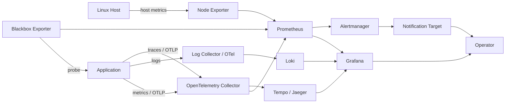

# 360-Degree Monitoring - Reference Architecture

## Reference flow

## Architecture principles

### Metrics

Prometheus should scrape infrastructure/application metrics. Node Exporter is appropriate for Linux host metrics. Synthetic availability checks should be separate from the target service so "service says it is healthy" is not the only signal.

### Logs

Centralize logs in Loki or an equivalent open-source backend. Do not use high-cardinality or sensitive values as labels.

### Traces

Send application traces to Tempo (or Jaeger) via the OpenTelemetry Collector. Configure Grafana to correlate a trace with the logs and metrics for the same time window and service, so an operator can go from "this request was slow" to "this is the span/log line that explains why" without switching tools. Traces matter most once a request crosses more than one service; for a single-service lab, exemplar-based correlation between a Prometheus metric spike and the matching trace is enough to demonstrate the pattern.

### Telemetry collection

OpenTelemetry Collector may be used as a vendor-neutral receiver/processor/exporter layer for application metrics, logs and traces.

### Dashboards as code

Provision dashboards/datasources/alerts through files or APIs where practical so a fresh deployment can recreate the observability environment.

### Alerting

Alert on user/operator-impacting symptoms rather than every possible internal metric. Critical alerts should include enough context to act and reference a runbook.

## Deployment profiles

### Profile A - Single-VM lab

Use Docker Compose or Podman Compose on one Linux VM. Suitable for most cohorts.

### Profile B - Multi-VM

Run monitoring services on one VM and exporters/agents on additional hosts. Suitable for infrastructure troubleshooting practice.

### Profile C - Kubernetes

Deploy components to Kubernetes using Helm/operators/manifests. This is an extension, not required for the base project.

## Security boundaries

- Do not expose Prometheus/Loki/Tempo directly to the public internet.
- Protect Grafana administrative access.
- Store notification credentials outside Git.
- Restrict exporter/collector ports to the monitoring network where possible.
