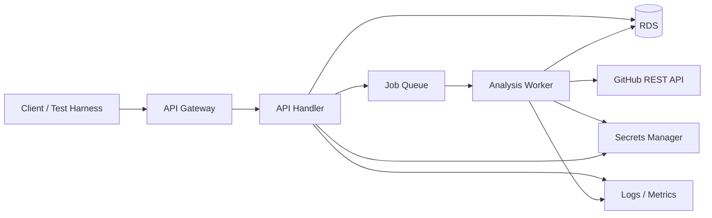

# GitHub Contributor Intelligence - Reference Architecture

## Reference AWS architecture

## Request lifecycle

1. Client submits repository/date range/branch scope.
2. API validates input and authentication.
3. API writes a `queued` job and publishes the job ID to a queue.
4. API returns `202 Accepted` with job/status URL.
5. Worker obtains GitHub App credentials securely and authenticates as an installation.
6. Worker lists branches as required.
7. Worker lists commits page by page for each selected branch/date range.
8. Worker deduplicates by commit SHA.
9. Worker normalizes contributor and domain attribution.
10. Worker writes commit/contributor/domain summary records transactionally.
11. Job status becomes `completed`, `partial` or `failed` with sanitized error metadata.
12. Client retrieves the summary.

## GitHub API design rules

- Make authenticated requests.
- Respect pagination.
- Track rate-limit headers/status and retry appropriately.
- Do not issue unnecessary concurrent requests.
- Pin the GitHub REST API version in requests and test upgrades.
- Prefer GitHub App installation authentication for automation.

## Worker choice

### Lambda

Appropriate when analysis duration and memory stay within Lambda execution constraints. If Lambda opens frequent short database connections, consider RDS Proxy.

### Container worker

Prefer ECS/Fargate or equivalent when repositories can create long-running jobs, large local working sets, or more predictable worker lifecycle requirements.

The Solution Intent must justify the selected profile.

## Database placement

Place RDS in private subnets for the reference AWS deployment. Application compute connects through security groups; the database should not need direct public internet access.

## Secrets

Store GitHub App private key/material and database credentials in Secrets Manager. Do not copy secrets into container images, Terraform variables committed to Git, or CI logs.
