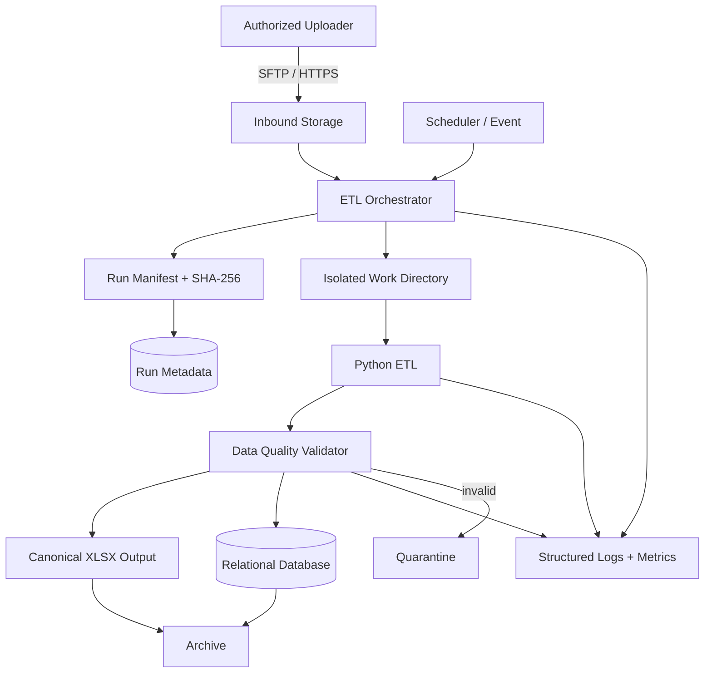

# Dynamic ETL - Reference Architecture

## Provider-neutral reference



## Reference deployment profiles

### Profile A - Open-source VM

Suitable for training and strict open-source software requirements:

- supported Linux VM;
- OpenSSH SFTP;
- encrypted volume for inbound/work/output if required;
- Python ETL service/package;
- MySQL Community 8.4 or approved equivalent;
- systemd timer or cron;
- Docker/Podman optional;
- Prometheus/OpenTelemetry-compatible metrics and structured logs.

### Profile B - Cloud-native

Use object storage/event scheduling plus managed relational database and managed secret storage while keeping ETL application code portable. Provider services must be documented in the Solution Intent and cost-controlled.

## Directory model for VM implementation

A reference layout:

```text
/opt/proleap-etl/
|-- inbound/        # accepted uploads awaiting processing
|-- work/           # per-run temporary extraction; restricted permissions
|-- output/         # canonical published output
|-- archive/        # immutable/retained source + run artifacts
|-- quarantine/     # invalid/failed packages
|-- config/         # non-secret schema/config
`-- logs/           # only if not using journal/central logging
```

Do not assume `/opt` itself is the security boundary; permissions, encryption, identity and transport all matter.

## Idempotency model

Each run has a unique `run_id` and source checksum.

For same-day reruns:

1. validate the new run fully;
2. begin database transaction;
3. replace/upsert the applicable logical data set according to the defined business key;
4. commit;
5. atomically replace canonical `model_YYYYMMDD.xlsx`;
6. keep run-specific archive/evidence;
7. mark run complete.

If any mandatory publication step fails, the run must not present itself as successful.

## Error model

Classify failures:

- `INGEST_INVALID`
- `ZIP_INVALID`
- `WORKBOOK_UNSUPPORTED`
- `MODEL_PAIR_MISSING`
- `DATA_VALIDATION_FAILED`
- `DATABASE_UNAVAILABLE`
- `DATABASE_COMMIT_FAILED`
- `OUTPUT_PUBLISH_FAILED`
- `ARCHIVE_FAILED`
- `INTERNAL_ERROR`

Logs should include `run_id` and sanitized source filename/checksum for correlation.
