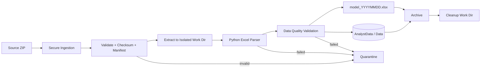

# Project 03 - Dynamic ETL Automation Platform

## Project statement

Build a secure, automated ETL platform that ingests ZIP archives containing client Excel workbooks, extracts quarterly values from Empirical Model and Regression Model sheets, produces a consolidated Excel output, persists normalized data to a relational database, archives the source package, and exposes enough telemetry for reliable operations.

This is the modernized successor to the original **Dynamic ETL** project. All legacy BR1-BR29 requirements are preserved through explicit traceability in [`BUSINESS_REQUIREMENTS.md`](BUSINESS_REQUIREMENTS.md).

## Modernization goals

The original business workflow remains intact, but the implementation is updated to remove avoidable fragility:

- secure ingestion replaces FTP-first design;
- current supported Linux replaces a fixed legacy CentOS dependency;
- extraction is label/schema aware rather than relying only on hard-coded cell positions;
- every run has a run ID, manifest and checksum trail;
- same-day reruns are idempotent and transactional;
- bad inputs go to quarantine rather than silently corrupting output;
- logs, metrics and alerts are first-class requirements;
- CI/CD and automated tests are required;
- infrastructure/configuration is reproducible.

## Core flow

## Required artifacts

- [Business Requirements](BUSINESS_REQUIREMENTS.md)
- [Architecture](ARCHITECTURE.md)
- [Data Dictionary](DATA_DICTIONARY.md)
- [Acceptance Criteria](ACCEPTANCE_CRITERIA.md)
- [Test Plan](TEST_PLAN.md)
- Completed SCQ and Solution Intent
- Requirements traceability matrix
- CI/CD pipeline
- Infrastructure/deployment automation
- Runbook
- Demo dataset or sanitized fixture

## Recommended implementation baseline

The capability is tool-agnostic, but an appropriate reference implementation is:

- supported Linux distribution;
- OpenSSH SFTP or object-storage upload for secure ingestion;
- Python 3.12+ with a tested Excel library;
- MySQL 8.4 LTS or another approved relational engine;
- Docker/Podman optional but recommended for repeatability;
- systemd timer/cron for schedule-driven lab deployment, or event-driven job triggering in cloud deployments;
- GitHub Actions/GitLab CI/Jenkins for CI/CD;
- structured logs and Prometheus/OpenTelemetry-compatible metrics where practical.

Exact versions must be pinned/tested by the implementation team.

## Base acceptance target

A valid normal batch must complete end to end in **30 minutes or less**, preserving the original project challenge.
