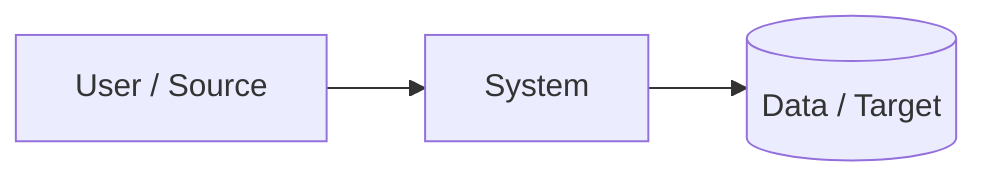

# Custom Live Project Proposal

## 1. Project name

`<name>`

## 2. Team

| Member | Role/responsibility |
|---|---|
| | |

## 3. Problem statement

What real problem are you solving?

## 4. Situation

Current process/system and evidence.

## 5. Challenge

Impact in time, cost, quality, reliability, security, scale or visibility.

## 6. Desired outcome

Use measurable language.

## 7. Target users/stakeholders

Who benefits or operates the system?

## 8. In scope

- 

## 9. Out of scope

- 

## 10. Proposed capabilities

| Capability | Why needed | Priority |
|---|---|---|
| | | Must/Should/Could |

## 11. Engineering dimensions

Mark the areas included:

- [ ] Linux/system administration
- [ ] API/application development
- [ ] Database/persistent state
- [ ] Cloud/virtualization
- [ ] IaC
- [ ] CI/CD
- [ ] Containers/Kubernetes
- [ ] Observability
- [ ] Security
- [ ] Automation/integration
- [ ] Troubleshooting/operations

## 12. Draft architecture

## 13. Data classification

Public / Internal / Confidential / Restricted

Explain any sensitive data and how it will be sanitized.

## 14. Acceptance criteria

| ID | Criterion | Evidence |
|---|---|---|
| AC-01 | | |

## 15. Major risks

| Risk | Probability | Impact | Mitigation |
|---|---|---|---|
| | | | |

## 16. Dependencies

Accounts, access, datasets, APIs, hardware, external teams, approvals.

## 17. Milestones

| Milestone | Target | Exit condition |
|---|---|---|
| Discovery/design | | |
| MVP | | |
| Operational readiness | | |
| Final demo | | |

## 18. Demo plan

Describe the normal flow, one failure, diagnosis and recovery.

## 19. Trainer decision

Status: `Pending`

Conditions/comments:
