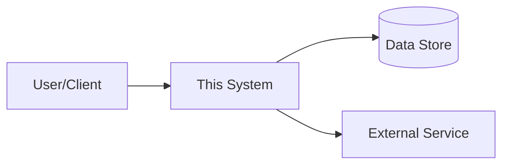
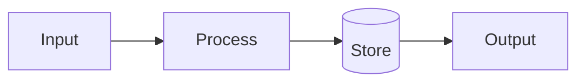

# Architecture - <Project Name>

## Document Control

| Field | Value |
|---|---|
| Prepared by | |
| Version | 0.1 |
| Date | |
| Status | Draft |
| Related Solution Intent | |

## 1. System Context

Who and what interacts with this system, and what sits outside its boundary.

## 2. Component Breakdown

| Component | Responsibility | Technology | Notes |
|---|---|---|---|
| | | | |

## 3. Data Flow

Describe how data moves through the system end to end: request or event in, processing, storage, response or output.

## 4. Technology Choices

| Layer | Choice | Why | Alternatives considered |
|---|---|---|---|
| | | | |

## 5. Non-Functional Requirements

### Reliability

### Security

### Observability

### Performance and scale

## 6. Key Decisions

List architecture decisions here as they're made, and record the full reasoning in an ADR under `ADR/` using [`ADR_TEMPLATE.md`](ADR_TEMPLATE.md). Don't duplicate ADR content in this section - link to it.

| Decision | ADR | Status |
|---|---|---|
| | | |

## 7. Known Limitations and Future Work
