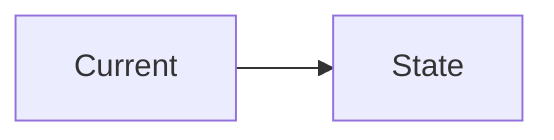
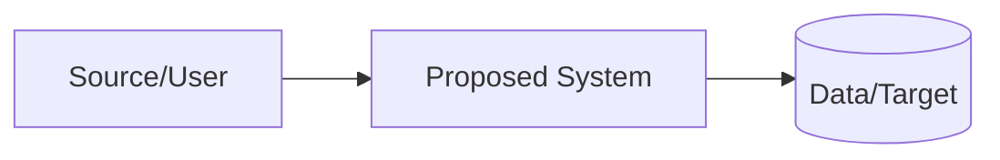

# Solution Intent - <Project Name>

## Document Control

| Field | Value |
|---|---|
| Customer/Stakeholder | |
| Prepared by | |
| Reviewers | |
| Version | 0.1 |
| Date | |
| Status | Draft |

## 1. Executive Summary

## 2. Situation and Challenge

## 3. Goals

- 

## 4. Non-Goals

- 

## 5. Scope

### In scope

### Out of scope

### Future scope

## 6. Requirements Summary

| ID | Requirement | Priority | Acceptance method |
|---|---|---|---|
| | | | |

## 7. Current-State Architecture

## 8. Proposed Target Architecture

### Component responsibilities

| Component | Responsibility | Technology/option | Rationale |
|---|---|---|---|
| | | | |

## 9. Data Flow and Data Model

## 10. Interfaces / API Contracts

## 11. Security Design

### Identity and access

### Secrets

### Encryption

### Network exposure

### Input validation

### Dependency/image security

### Audit/logging

### Data classification and retention

## 12. Reliability and Recovery

### Failure modes

| Failure | Detection | Behavior | Recovery |
|---|---|---|---|
| | | | |

### Retry/timeouts

### Idempotency

### Backup/restore

### RTO/RPO if applicable

### Rollback

## 13. Observability

| Signal | What is measured/logged | Alert/action |
|---|---|---|
| Health | | |
| Metrics | | |
| Logs | | |
| Traces | | |

## 14. CI/CD and Release Strategy

## 15. Infrastructure and Configuration

## 16. Testing Strategy

| Test type | Scope | Tool/approach | Exit condition |
|---|---|---|---|
| Unit | | | |
| Integration | | | |
| E2E | | | |
| Negative | | | |
| Security | | | |
| Performance | | | |
| UAT | | | |

## 17. Migration / Rollout / Cutover

## 18. Assumptions

| ID | Assumption | Impact if false | Owner | Validation date |
|---|---|---|---|---|
| | | | | |

## 19. Dependencies

## 20. Risks

| Risk | Probability | Impact | Owner | Mitigation |
|---|---|---|---|---|
| | | | | |

## 21. Open Questions

| ID | Question | Owner | Needed by | Status |
|---|---|---|---|---|
| | | | | Open |

## 22. Alternatives Considered

| Option | Advantages | Disadvantages | Decision |
|---|---|---|---|
| | | | |

## 23. Effort Estimate and Milestones

| Work package | Estimate | Dependencies | Exit condition |
|---|---:|---|---|
| | | | |

## 24. Acceptance Criteria

## 25. Approval

| Reviewer | Decision | Date | Conditions |
|---|---|---|---|
| | | | |
